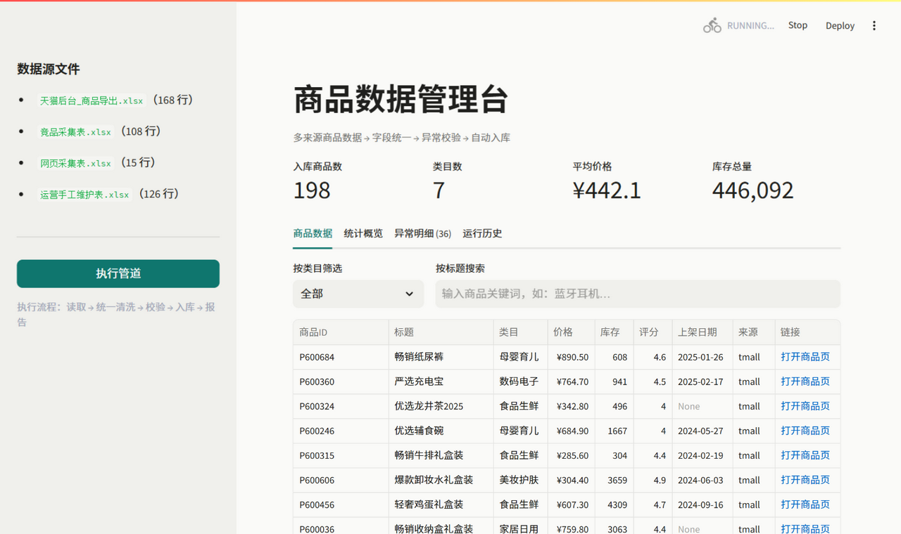
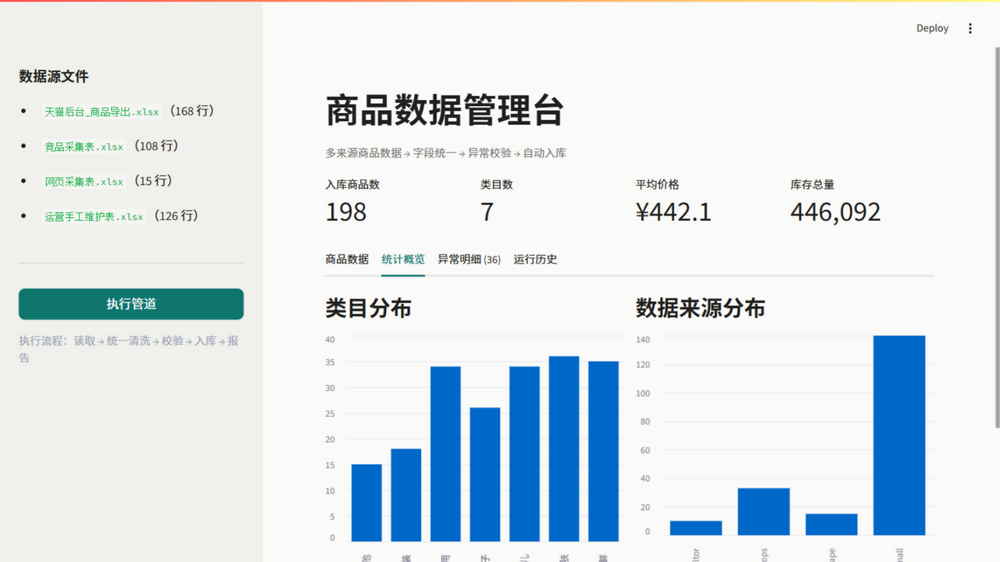
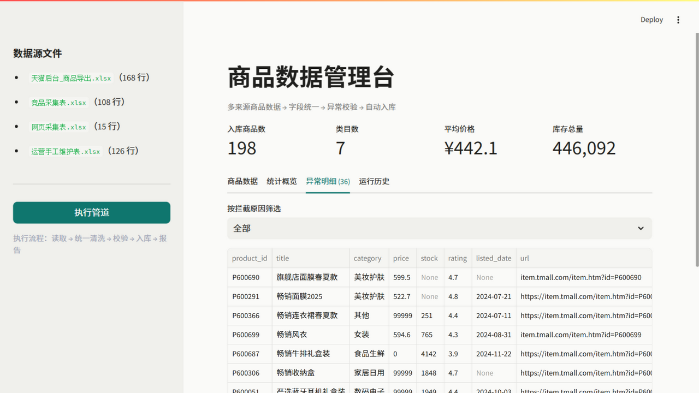
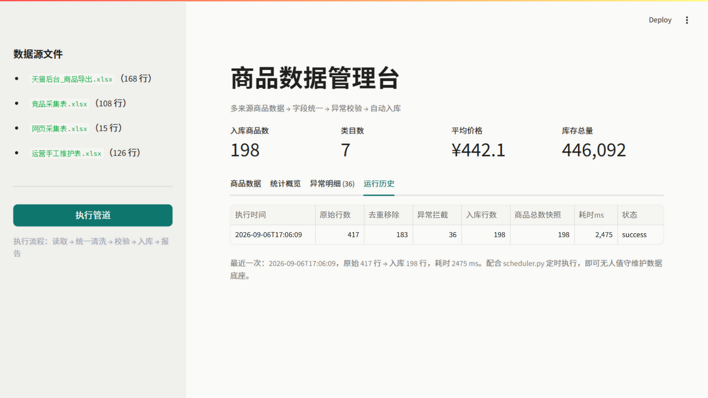

# 商品数据底座（product-data-foundation）

面向电商运营场景的商品数据系统：真实网页采集 + 多来源异构数据统一清洗入库 +
异常校验报告 + 定时调度 + 可视化管理台 + 运行历史，形成无人值守的数据底座闭环。

> 对应真实业务痛点：电商公司里运营数据散落在后台导出表、手工维护表、
> 采集脚本输出中，列名不一、格式混乱、重复冗余，没有可分析的数据底座。

## 系统架构

```
pipeline/scrape.py（可选）  data/raw/*.xlsx            pipeline/                     output/
┌───────────────────┐    ┌──────────────────┐
│ 真实网页采集       │──▶│ 天猫后台_商品导出  │┐
│ books.toscrape.com │    ├──────────────────┤│  ┌──────────┐ ┌──────────┐ ┌──────────┐    ┌──────────────┐
└───────────────────┘    │ 运营手工维护表    │┼─▶│ extract  ├▶│ transform├▶│ validate ├───▶│ product_db   │
pipeline/scheduler.py    ├──────────────────┤│  │ 批量读取  │ │ 字段统一  │ │ 异常校验  │    │ 商品+类目+    │
┌───────────────────┐    │ 竞品采集表        │┘  └──────────┘ │ 清洗/去重 │ └────┬─────┘    │ 运行历史表    │
│ 定时调度           │──▶│ 网页采集表        │                └──────────┘      │         └──────────────┘
│ 无人值守循环执行    │    └──────────────────┘                                 ▼
└───────────────────┘             ▲                                  ┌──────────────┐
                                  └── 新数据源只需两处注册 ──          │ 校验报告.xlsx │
                                                                     └──────────────┘
```

## 快速开始

```bash
pip install -r requirements.txt

# 1.（可选）采集真实网页数据：books.toscrape.com，输出第 4 个数据源
python pipeline/scrape.py --limit 15

# 2. 生成模拟脏数据（其余三个数据源；真实场景替换为业务导出表）
python scripts/generate_mock_data.py

# 3. 运行管道（可重复执行，入库幂等，每次运行写入运行历史）
python pipeline/run_pipeline.py

# 4. 定时调度（无人值守，每 60 分钟自动执行一次）
python pipeline/scheduler.py --interval 60

# 5. 打开可视化管理台（浏览器自动访问 http://localhost:8501）
python -m streamlit run pipeline/app.py
```

## 单元测试

```bash
python -m pip install pytest
python -m pytest tests/ -q
```

覆盖：容错解析（￥前缀/元后缀/全角/千分位/负号）、多格式日期、类目别名归一、
来源优先级去重、全部校验规则（含"缺失放行、非法拦截"的日期策略）。

## 可视化管理台

`pipeline/app.py` 提供一个 Streamlit 界面，把管道从"开发者跑脚本"升级为"运营可用的工具"：

- **一键执行管道**：侧边栏按钮触发全流程，带执行状态反馈
- **商品数据查询**：按类目筛选、按标题搜索，支持导出 CSV；筛选状态同步到 URL，可分享带筛选的链接
- **统计概览**：类目分布、来源分布图表，核心指标卡（入库数/类目数/均价/总库存，千分位格式）
- **异常明细复核**：按拦截原因筛选被校验拦下的数据（页签实时显示条数），人工确认后修正源数据重跑

界面遵循 Web Interface Guidelines（Vercel）审查优化：标签置于输入框上方、占位符含示例格式、
空状态给出下一步指引、错误信息附带修复方式；主题采用单一低饱和强调色 + 中性底色
（见 `.streamlit/config.toml`）。

## 界面预览

| 商品数据总览 | 统计概览 |
|---|---|
|  |  |

| 异常明细复核 | 运行历史 |
|---|---|
|  |  |

## MCP Server（AI 直连数据底座）

`pipeline/mcp_server.py` 把数据底座暴露为 MCP（Model Context Protocol）服务器，
Claude Code / ZCode 等 AI 客户端注册后即可用自然语言直接查询商品数据、运行历史——
数据从"给人看的报表"升级为"给 AI 调用的工具层"。

| 工具 | 作用 |
|------|------|
| `query_products` | 按类目 / 标题关键词查询商品列表 |
| `get_categories` | 类目维度表（各条目数、均价） |
| `get_stats` | 底座总览（总数、来源分布） |
| `get_pipeline_runs` | 管道运行历史 |

- **协议实现**：MCP over stdio（JSON-RPC 2.0，握手 / 工具发现 / 工具调用 / 错误码）。
  官方 MCP Python SDK 要求 Python 3.10+，本机为 3.8，故按协议规范以标准库实现，
  接口兼容官方客户端，可平滑替换为 FastMCP。
- **安全设计**：数据库以只读模式打开（SQLite `mode=ro`），AI 只能查询、无法写入——
  对应"不用管理员账号 / 不拿生产数据做无保护测试"的数据安全意识。
- **注册方式**：在 MCP 客户端中添加 stdio server，command 为 `python`，
  args 为 `pipeline/mcp_server.py` 的绝对路径。
- **测试**：13 项协议与工具单元测试，另附 stdio 端到端冒烟流程。

## 部署（Docker）

```bash
docker compose up -d        # 构建并启动，管理台 http://localhost:8501
```

`data/` 与 `output/` 以 volume 挂载进容器，重建镜像不丢数据。
镜像内使用国内 pip 镜像源加速依赖安装。

> 说明：开发机未安装 Docker，Dockerfile / compose 已按标准编写但构建流程未在本机实测，
> 首次部署如遇问题按报错调整即可。

运行结果示例：

```
[读取] 天猫后台_商品导出.xlsx: 168 行 | 运营手工维护表.xlsx: 126 行 | 竞品采集表.xlsx: 108 行
[统一] 三来源合并: 402 行，统一为 9 个标准字段
[去重] 移除重复商品 183 行（保留来源优先级最高的一条）
[校验] 通过 190 行，拦截 29 行
[入库] 商品主表 190 行，类目维度表 7 行 -> product_db.sqlite
```

## 设计要点

| 问题 | 方案 |
|------|------|
| 三个来源列名互不一致 | 每来源一张列名映射表（`COLUMN_MAPPING`），入管道即统一 schema |
| 类目命名混乱（繁简/别名/简称） | 归一化 + 别名映射表（`CATEGORY_ALIAS`），未知类目兜底为"其他" |
| 价格带 ￥ 前缀、"xx元" 后缀、全角数字 | 容错解析：全角转半角 + 正则抽取数值 |
| 日期四种格式混用 | 多格式尝试解析，统一为 ISO8601；缺失允许为空，非法才拦截 |
| 多来源重复商品 | 按来源可信度优先级去重（后台导出 > 手工表 > 采集表） |
| 脏数据污染数据底座 | 校验规则拦截 + 异常明细落报告，宁可拦下人工复核 |
| 重复执行产生重复数据 | 业务主键 REPLACE 入库，管道幂等可重跑 |
| 入库后再出错 | 数据库层 CHECK 约束兜底（价格/库存），双保险 |

## 校验规则

| 规则 | 逻辑 |
|------|------|
| 必填字段缺失 | 商品ID、标题任一为空 → 拦截 |
| 价格异常 | 解析失败、≤0 或 >10000 → 拦截 |
| 库存异常 | 缺失或负数 → 拦截 |
| 日期非法 | 有值但无法按已知格式解析 → 拦截（缺失放行，入库为 NULL） |
| 链接非法 | 非 http(s) URL 格式 → 拦截 |

## 表结构（职责：商品基础数据表）

- `category` 类目维度表：类目统一后单独建表，商品表只存外键
- `product` 商品主表：业务主键 = 平台商品ID，含 CHECK 约束与常用索引

DDL 按 SQLite 编写，注释中给出 MySQL 迁移对照（AUTO_INCREMENT / VARCHAR / DECIMAL / utf8mb4）。

## 说明

- 本项目使用**模拟数据**做技术验证，模拟文件复刻了真实运营数据的典型脏点；
  接入真实数据只需把文件放入 `data/raw/` 并维护列名映射。
- 开发过程采用 AI 辅助编程（需求拆解 → 代码生成 → 调试 → 幂等性验证），
  全部代码可读、可改、可讲解。
